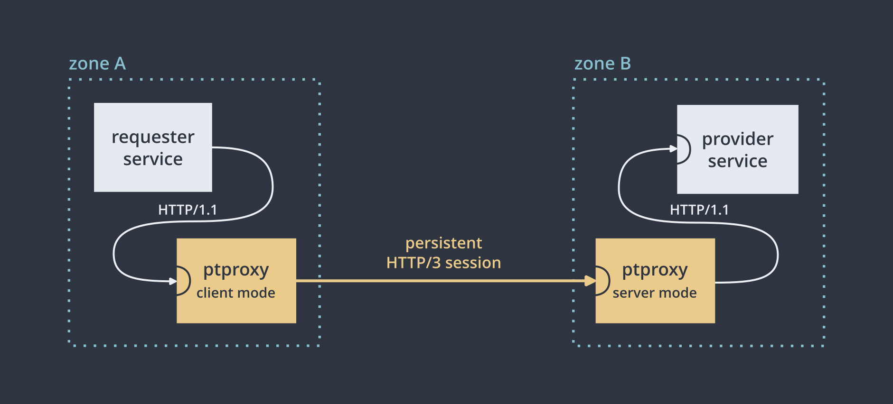

# ptproxy

  * [Motivation](#motivation)
    + [What's this?](#whats-this)
    + [Why do I need this? What's a sensitive network link?](#why-do-i-need-this-whats-a-sensitive-network-link)
    + [What's wrong with a VPN?](#whats-wrong-with-a-vpn)
    + [What's wrong with HTTP\[S\]?](#whats-wrong-with-https)
    + [What's wrong with existing reverse proxies?](#whats-wrong-with-existing-reverse-proxies)
    + [What's this again?](#whats-this-again)
  * [Usage](#usage)
    + [Prerequisites](#prerequisites)
    + [Initial setup](#initial-setup)
    + [Tuning](#tuning)
    + [systemd service](#systemd-service)
  * [Special features](#special-features)
    + [systemd integration](#systemd-integration)
    + [Reconnection](#reconnection)

## Motivation

### What's this?

It's an ad-hoc solution to proxy HTTP/1.1 requests over a sensitive network link.

A typical scenario of use is when you have a service (A) that needs to consume an HTTP API offered by another service (B), and those services are separated by a *sensitive network link* such as the public internet (e.g. they are in different datacenters). Rather than pointing A directly at B, you would start a ptproxy instance next to A in client mode, and a ptproxy instance next to B in server mode. Both ptproxy instances maintain a persistent session, and A issues HTTP requests to its ptproxy, which sends them over to B's ptproxy, which issues them at B.

### Why do I need this? What's a sensitive network link?

HTTP/1.1 has become the *lingua franca* for communication among microservices due to its simplicity and wide support. It usually works over inter-container or inter-datacenter links, but depending on the application it may be unsuitable to transport over some links (such as the public internet) for reasons such as:

 - **Substantial latency:** for applications that are latency-sensitive enough, the delay from additional RTTs introduced by TCP (such as in connection establishment, flow control and congestion control) may be prohibitive.

 - **Insecure:** links that cross untrusted boundaries, such as the public internet, may require requests to travel encrypted and authenticated against MITMs.

 - **Unstable:** the link may not have a known or guaranteed bandwidth, may be jittery or lossy, or may be subject to occasional or frequent congestion.

 - **Low bandwidth / transfer:** the link may be transfer-billed or have low bandwidth, benefitting from transport efficiency.

We say "sensitive network link" to refer to links that have at least some of these unwanted properties. Whether that's the case often depends on the particular application.

### What's wrong with a VPN?

An overlay network can get you a secure link over an insecure one, but it can't make the other problems (especially extra latency from establishment, congestion control) go away. A solution based around the request-response model is more appropriate here.

### What's wrong with HTTP\[S\]?

Nothing actually. TCP and TLS are in theory prepared to handle the above challenges (e.g. for latency there's TCP Fast Open and TLS 0-RTT), and there are some techniques that can be used to improve latency and stability (such as connection pooling, pre-establishment, HTTP/1.1 keepalive, pipelining). HTTP/2 allows multiplexing requests over a single connection (which improves congestion handling and removes the need for many earlier techniques) and compresses headers for efficiency. HTTP/3 drops TCP in favor of a better transport layer (QUIC) with a variety of improvements around handshake speed, size, head of line blocking and congestion control.

But having the final applications (i.e. the microservices) directly communicate this way is unfeasible, because:

 - Most do not implement many of the mentioned protocols / techniques (often including TLS), and rarely expose the necessary tweaks. This is often exacerbated by lack of language or OS support.

 - Even if they do, it's unpractical to configure the necessary tweaks directly at the application: the mechanism, knobs and units could vary in each case.

 - When more than one instance needs to access the link (i.e. load balancing or scaling) this can result in unnecessary connections, worsening response to congestion.

The solution to this is using a *reverse proxy* at each end of the link: this decouples application deployment from infrastructure, allows managing knobs from a central place, swapping services easily, etc. This is what ptproxy does.

### What's wrong with existing reverse proxies?

Most reverse proxies don't support the described usecase (a point-to-point link) very well. They usually act as a front server, accepting requests from final users and delivering them to upstreams over a private, controlled link. This design manifests in several ways:

 - The default congestion control is very conservative, which is okay for front servers but bad (sometimes even prohibitive) for point-to-point sessions. Since there's previous knowledge about the link, CC could be relaxed accordingly, but few proxies provide tweaks for this.

 - Support for HTTP/3 is also lacking in general, and even when the proxy supports it, it may not offer it as option for upstream requests (which is what we need here).

 - Configuration for this usecase is unintuitive and often has pitfalls (nginx for example does not validate upstream's certificate by default, supports compressing responses but not requests, doesn't enable TCP keepalive by default, needs clearing the `Connection` header for keepalive to be actually in place, needs a set of identically named directives on different modules to be added to both ends...).

 - The HTTP session isn't established until the first request(s) arrive, incurring additional latency for those. Also for nginx, the session isn't kept alive forever but for a default of 1h (it could be made to be infinite by touching several settings in both ends, but this isn't recommended because of the design of the server).

### What's this again?

ptproxy is a reverse proxy designed specifically for the use case of point-to-point links. It's meant to be portable, offer good control over the transport, easy to set up in both ends and relatively lightweight (though throughput isn't the main priority). In the future it could support niche features such as reporting metrics of the established session, sessions against different servers, multiplexing different endpoints over the same session, ACLs...

Right now ptproxy only supports HTTP/3 as transport across instances. In addition to the transport improvements mentioned above, being userspace-based gives us better control over all tweaks independently of the OS. An important downside is that offload optimizations (both in kernel, hypervisors and routers) are much more developed around TCP than UDP.

ptproxy is written in Rust for:

 - **Portability:** HTTP/3 support is a mess in mainland Linux distros thanks to OpenSSL, and Rust avoids dependency on system libraries altogether. It also has much better crossplatform support.

 - **Control:** Rust's HTTP/3 ecosystem offers much more control, with most components allowing dependency injection, meaning internal knobs are less likely to be left unexposed. The stack is fully async and even compatible with custom event loops, should we need them in the future.

## Usage

> **⚠️ Warning:** while usable, this is still in the proof-of-concept stage, and lacks support for many minor and not-so-minor features (like WebSocket proxying, or the `X-Forwarded-For` / `Forwarded` headers). Use at your own risk.

### Prerequisites

To install ptproxy, download the latest production binary from the [releases][] section and drop it under e.g. `/usr/bin`. The binary depends only on glibc 2.29+, so it's reasonably portable.

> Alternatively, install [rustup][] and switch to the nightly toolchain (`rustup default nightly`), clone this project and run `cargo build --release`. The resulting binary is at `target/release/ptproxy`.

ptproxy peers mutually verify each other, so you'll need client certificates for one host and server certificates for the other. I recommend using [mkcert][] to generate these certs:

~~~ bash
$ mkcert -client foo.example.org
$ mkcert bar.example.org
~~~

### Initial setup

Deploy ptproxy, the CA cert and the corresponding certificate & key to each end. Then you'll need to create a configuration file for each. A minimal example looks like this:

 - **client side** (where requests originate):

   ~~~ toml
   [general]
   mode = "Client"
   peer_hostname = "bar.example.org"
   # where to listen for HTTP/1.1 requests
   http_bind_address = "127.0.0.1:20080"

   [tls]
   # CA to validate the peer against
   ca = "rootCA.pem"
   # certificate to present to the other peer
   cert = "foo.example.org-client.pem"
   key = "foo.example.org-client-key.pem"
   ~~~

 - **server side** (where requests are served):

   ~~~ toml
   [general]
   mode = "Server"
   peer_hostname = "foo.example.org"
   # where to send requests from the peer to
   http_connect_address = "localhost:8081"

   [tls]
   # CA to validate the peer against
   ca = "rootCA.pem"
   # certificate to present to the other peer
   cert = "bar.example.org.pem"
   key = "bar.example.org-key.pem"
   ~~~

ptproxy uses port **20010** for the HTTP/3 tunnel between the peers, but it can be customized by setting the `quic_port` parameter in both ends. Make sure this UDP port is open on the server end. Then start ptproxy and, if everything is correct, you should see this:

 - **client side**:

   ~~~
   $ ptproxy --config client.toml
   2023-07-24T19:10:23.877447Z  INFO ptproxy: started endpoint at [::]:60395
   2023-07-24T19:10:23.889674Z  INFO ptproxy: connection 94756025388432 established
   2023-07-24T19:10:23.892695Z  INFO ptproxy: tunnel ready
   ~~~

 - **server side**:

   ~~~
   $ ptproxy --config server.toml
   2023-07-24T19:10:22.512993Z  INFO ptproxy: started endpoint at [::]:20010
   2023-07-24T19:10:23.892110Z  INFO ptproxy: connection 140126596472240 established ([::ffff:81.135.102.59]:60395)
   ~~~

This means both instances have successfully established an HTTP/3 session. Try sending some requests to `http://127.0.0.1:20080/` on the client end, and you should see them sent at `http://localhost:8081/` on the other side. If one end goes down and back up again, they should reconnect in a few seconds. See the [configuration fields][config-docs] for more details.

### Tuning

Once the tunnel is working, the next step is usually to tune some of the parameters in the [`[transport]` section][transport-config-docs] of the configuration file to meet your needs. Like TCP, QUIC's [congestion control][] has very conservative defaults. But since this session goes over a known link, we can relax some of them to provide better throughput / latency without the need for the session to warm up.

In particular, you may want to specify the *round-trip time* of the link and the *initial congestion window*, which you can derive using:

$$
    \text{cwnd} = \text{guaranteed bandwidth (B/sec)} \times {\text{rtt (sec)}}
$$

For a 150ms link assumed to provide 30mbps, this means adding the following to the config file:

~~~ toml
[transport]
# initial estimate of the link's RTT (milliseconds)
initial_rtt = 150
# initial congestion control window (bytes)
initial_window = 487500
~~~

In general it is best to keep the transport parameters consistent on both sides.

It's highly recommended to use a stress-testing tool like [ab][] to get a feel of the tunnel's performance. While you might expect the latency to equal 1 RTT once properly configured, it will likely be more due to *packet pacing*, a layer that aims to reduce data bursts to prevent data loss. It shapes the traffic to conform to the bandwidth determined by the congestion control window.

### systemd service

To deploy this as a systemd service, it's recommended to use the [service template feature][systemd-service-templates] to allow for multiple tunnels to be managed easily.
Create `/usr/lib/systemd/system/ptproxy@.service` with the following contents:

~~~ ini
[Unit]
Description=point-to-point HTTP/1.1 reverse proxy (%I)
After=network.target
After=network-online.target
Wants=network-online.target
Documentation=https://github.com/mildsunrise/ptproxy

[Service]
Type=notify
ExecStart=/usr/bin/ptproxy -c /etc/ptproxy/%i.toml
KillSignal=SIGINT
WatchdogSec=6s
DynamicUser=true
TasksMax=128
RestartSec=5s
Restart=on-failure

[Install]
WantedBy=multi-user.target
~~~

Then create a system user for ptproxy, a configuration directory, and reload systemd:

~~~ bash
useradd --system ptproxy
mkdir /etc/ptproxy
mkdir /etc/ptproxy/private
chown ptproxy:ptproxy /etc/ptproxy/private
chmod og-rx /etc/ptproxy/private
systemctl daemon-reload
~~~

Place your TLS files and configuration at `/etc/ptproxy/` and, assuming your configuration is named `foo.toml`, you can enable & start the tunnel with:

~~~ bash
systemctl enable --now ptproxy@foo
~~~

## Special features

### systemd integration

If ptproxy is launched from systemd (or another service manager supporting the [notify protocol][systemd-notify]), it will do the following:

 - Signal `READY` and `STOPPING` states accordingly.

   In client mode, `READY` is by default deferred until the first connection attempt ends (successfully or not). This gives a reasonable opportunity for the tunnel to establish before starting dependent units. Because connection attempt time is mostly bounded by `max_idle_timeout` (see below), the unit will not stay in 'starting' state indefinitely. See the `wait_for_first_attempt` option.

 - Report server status. In server mode this amounts to whether the server has started or if it's stopping (waiting for outstanding connections to close). In client mode, ptproxy also reports the status of the tunnel (and in case it's down, the most recent failure reason).

 - Sends keep-alive pings if watchdog functionality is enabled in the service manager. This is the recommended setup, so that the service gets restarted in the event of a deadlock, infinite loop or other silent failure. Please open a bug if that happens.

   Keep-alive pings are currently sent from the thread running the main task (client / server loop), and theoretically it could happen that deadlocks occur exclusively on other threads and stay undetected. We could improve this by having the main loop check upon the rest of the tasks, but in practice the risk of such a thing happening while also preventing the service from operating is very small.

   The interval for keep-alive pings is derived from the watchdog limit (given in the `WATCHDOG_USEC` environment variable) divided by `watchdog_factor`.

### Reconnection

ptproxy will constantly attempt to connect to the server, sleeping for `connect_interval` milliseconds between connection attempts.

In the initial phase of a connection attempt before contact has been made with the other peer, the `max_idle_timeout` transport parameter governs how much time needs to pass before the attempt fails (at which point ptproxy will go to sleep and later start another attempt). Once the connection successfully establishes, `max_idle_timeout` is combined with the other peer's to determine how much to wait without traffic to declare the connection dead (at which point ptproxy goes to sleep and later attempts to reconnect).

[rustup]: https://rustup.rs
[config-docs]: https://ptproxy.alba.sh/ptproxy/config/struct.Config.html
[transport-config-docs]: https://ptproxy.alba.sh/ptproxy/config/struct.TransportConfig.html
[mkcert]: https://github.com/FiloSottile/mkcert
[releases]: https://github.com/mildsunrise/ptproxy/releases
[congestion control]: https://quicwg.org/base-drafts/rfc9002.html
[ab]: https://httpd.apache.org/docs/2.4/programs/ab.html
[systemd-service-templates]: https://www.freedesktop.org/software/systemd/man/systemd.service.html#Service%20Templates
[systemd-notify]: https://www.freedesktop.org/software/systemd/man/sd_notify.html
